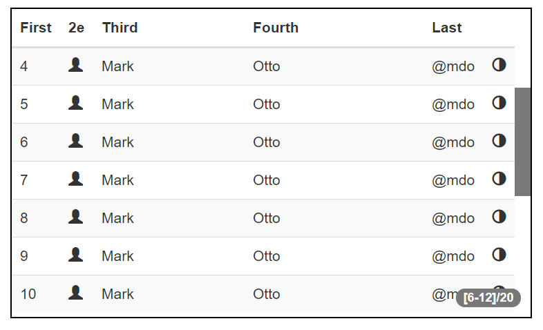

**ng-infinity-scroll** 
[](https://travis-ci.org/hhdevelopment/ng-infinity-scroll)

ng-infinity-scroll is a directive for angular 1.x

it allows to use angular directive *limitTo* synchronized with a scrollbar.

It is very usefull to use this directive when you try to show many rows in the table for example.

Define size of your table in pixel and infinity-scroll compute pertinent limit and manage begin variables.



---

## Demo

http://hhdev.fr/ng-infinity-scroll/index.html#

---

## Installation

Installation is easy with minimal dependencies - only the AngularJS and Jquery

#### Install with NPM

```sh
$ npm install ng-infinity-scroll
```

### Adding dependency to your project

When you are done downloading all the dependencies and project files the only remaining part is to add dependencies on the `infinity.scroll` AngularJS module:

```js
require('./node_modules/ng-infinity-scroll/dist/infinityscroll.js');
```

```js
angular.module('myModule', ['infinity.scroll']);
```

## Uses

### HTML

```html
<infinity-scroll scrollbar-size="md" show-info-delay="2000" total="ctrl.items.length" 
					ng-begin="begin" ng-limit="limit"
					style="border:solid 1px black;height:300px">
	<table class="table table-hover table-striped">
		<thead>
			<tr>
				<th style="width:30px">First</th>
				<th style="width:20px">2e</th>
				<th>Third</th>
				<th>Fourth</th>
				<th style="width:50px">Last</th>
				<th style="width:20px"></th>
			</tr>
		</thead>
		<tbody>
			<tr ng-repeat="item in ctrl.items| limitTo:limit:begin">
				<td ng-bind="item"></td><td><span class="glyphicon glyphicon-user"></span></td><td>Mark</td><td>Otto</td><td>@mdo</td><td><span class="glyphicon glyphicon-adjust"></span></td>
			</tr>
		</tbody>
	</table>
</infinity-scroll>
```

```js
(function (ng) {
	'use strict';
	ng.module('app', ['infinity.scroll']).controller('AppCtrl', AppCtrl);
	function AppCtrl() {
		var ctrl = this;
		ctrl.items = [.......];
	}
})(angular);
```

### Configuration

Important : For vertical infinity-scroll container, you have to set the height css property. Instead, you can set max-height.  
If you use max-height, you will see the item drawed one by one. Prefer height, mostly if many items will be visible. 

### Attributes configuration

1. total (number) : The number of items
3. ng-limit : the limit of window for directive limitTo. This value is managed by the directive, don't set it, just name it, in controller or scope
4. ng-begin : the begin of window  for directive limitTo. This value is managed by the directive, don't set it, just name it, in controller or scope
5. tag-items (string) (optional) : Define the tagname of node repeated by directive ng-repeat. Default value 'tr', without quote.
6. scrollbar-size (string) (optional) : Define the size of scrollbar. Values('xs', 'sm', 'md', 'lg'), without quote. xs:4px, sm:8px, md:16px, lg:20px. Default value md
7. show-info-delay (number) (optional) : define the delay of time the infos about the window appears. Default value 1000 ms
8. debounce (number) (optional) : Set the delay before compute ng-limit. Default value 300 ms
9. collapsible (optional) : The scrollbar appears only when the mouse is over the container.

### Class configuration

scroll-horizontal (optional) : change direction of scroll box
